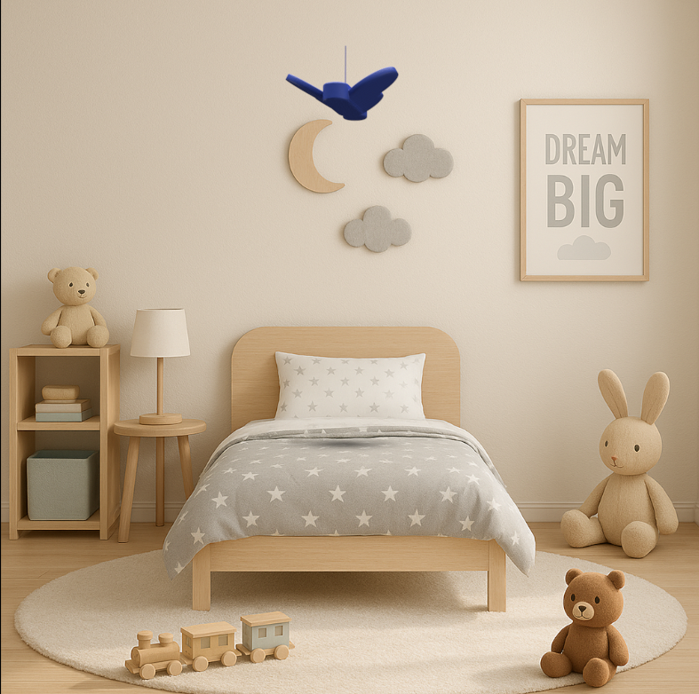

# slimme lichtprojector
de slimme lichtprojector die kinderen ondersteunt bij het krijgen van een goede nachtrust.

🛠️ Built by Felix Vanhoutte & Jendrik Bottelberghe   
🔥 Supervised by prof. dr. Bas Baccarne& Yannick Christiaens. 
🌱 Grown at Ghent University 🏛️ Industrial Design Engineering ([project overview](https://github.com/basbaccarne/human-centered-design))       

11/12/2025 van de laatste update*   

## Samenvatting
Slaapregressie bij jonge kinderen tussen 1,5 en 2,5 jaar vormt een terugkerend probleem voor gezinnen. Kinderen worden ’s nachts herhaaldelijk wakker en zoeken nabijheid en emotionele geruststelling, terwijl ouders te maken krijgen met slaaptekort, onzekerheid en een verhoogde mentale belasting. Bestaande oplossingen sluiten onvoldoende aan bij deze leeftijdsfase en vereisen vaak actieve ouderlijke tussenkomst of zorgen voor extra prikkels.

Het probleem werd onderzocht via gebruikersonderzoek en benchmarkanalyse. Er werden drie semigestructureerde interviews afgenomen met ouders en een grootouder die ervaring hebben met slaapregressie. De interviews focusten op nachtelijke patronen, emotionele impact en het gebruik van bestaande hulpmiddelen en werden geanalyseerd via thematische analyse. Daarnaast werd een benchmark uitgevoerd van tien bestaande producten en diensten rond slaapondersteuning bij jonge kinderen.

Op basis van deze inzichten werd een warm, slaapondersteunend systeem voorgesteld dat inspeelt op emotionele regulatie in plaats van gedragssturing. De oplossing maakt gebruik van subtiele zintuiglijke signalen zoals zacht licht, geluid en ritme, zonder schermen of actieve interactie.

Door automatisch en passief te werken, biedt het systeem het kind een gevoel van nabijheid en veiligheid, terwijl de nood aan nachtelijke ouderlijke tussenkomst vermindert. Zo creëert de oplossing rust voor zowel kind als ouder.

## Introductie
De slimme lichtprojector biedt hulp aan kinderen met slaapproblematiek. Het probleem dat ouders midden in de nacht wakker gemaakt worden door hun kinderen dient opgelost te worden met behulp van ons project. De slimme lichtprojector merkt op dat het kind ontwaakt en schiet meteen in actie. De projector schijnt rustgevende, ritmische beelden of strobes en maakt witte ruis om het kind rustiger te maken. De instellingen van de projector kunnen door de ouders ingesteld worden met behulp van een app. Zo kan het product op elk kind afgesteld worden. Het is de bedoeling dat de projector zo gemakkelijk mogelijk te installeren is, zonder veel kabels te moeten verbinden of gaten te moeten boren in het plafond. 

## Inhoudstafel

1. [Methodologie](./docs/methodologie.md)
2. [Discovery](./docs/discovery.md)
3. [Definition](./docs/definition.md)
4. [Design Requirements](./docs/design_requirements.md)
5. [Bill of materials](./docs/bom.md)

## Kritische reflectie
Max. 500 woorden

## Noot inzake het gebruik van AI
AI werd in dit project gebruikt om duiding te geven bij opdrachten, het helpen opstellen van de protocols met eigen bijsturing, en het herschrijven en grammatisch corrigeren van bepaalde stukken tekst. Artificiële intilligentie werd niet gebruikt als bron, echter biedde het wel hulp bij het uitleggen en sturen van onderzoek.

## Bijlagen
### Discovery
* Literatuuronderzoek 
  * [Protocol](./reports%20and%20protocols/Bottelberghe_Jendrik_Protocol%20literatuuronderzoek%20JB.pdf)
  * [Rapport](./reports%20and%20protocols/Bottelberghe_Jendrik_rapportering%20literatuuronderzoek%20JB.pdf)
* Benchmarkonderzoek
  * [protocol](./reports%20and%20protocols/Benchmarkprotocol_slaapregressie%20Felix.pdf)
  * [rapport](./reports%20and%20protocols/Benchmark_uitvoering_slaapregressieFelix.pdf)
* Interviews (N=6)
  * [Protocol_Jendrik_1](./reports%20and%20protocols/Bottelberghe_Jendrik_Interview_protocol_PGGO_dokter%20JB.pdf)
  * [protocol_Jendrik_2](./reports%20and%20protocols/Bottelberghe_Jendrik_Interview_protocol_PGGO_ouders%20JB.pdf)
  * [protocol_Felix](./reports%20and%20protocols/Interview%20-%20protocol%20Felix.pdf)
  * [Rapport_Jendrik](./reports%20and%20protocols/Bottelberghe_Jendrik_Rapportering%20interviews%20JB.pdf)
  * [rapport_Felix](./reports%20and%20protocols/Interview%20report%20Felix.pdf)
### Definition
* User testing wave 1 (N=4)
  * [Protocol_Jendrik](./reports%20and%20protocols/Bottelberghe_Jendrik_onderzoeksprotocol%20ophangsysteem.pdf)
  * [Rapport_Jendrik](./reports%20and%20protocols/Bottelberghe_Jendrik_rapportering%20TAP.pdf)
* User testing wave 2 (N=4)
  * [Protocol_Felix](./reports%20and%20protocols/Onderzoeksprotocol%20spreekfunctie,%20energievoorziening%20(QAP).pdf)
  * [Rapport_Felix](url)

## Licentie
>

This repository contains both software and design materials created as part of an industrial design energineering project at Ghent University.

- **Software and code:** [MIT License](./LICENSE-MIT)  
- **Design, documentation, CAD, and media:** [CC BY 4.0 License](./LICENSE)
  
You are free to reuse and build upon this work, both commercially and non-commercially, as long as proper attribution is given to the original authors.

## Bronnen
 [^1]: Thomas, T., & Ritter, A. (2022). Wandering & sundowning in dementia. _Practical Neurology, 21_(3), 36–44.
