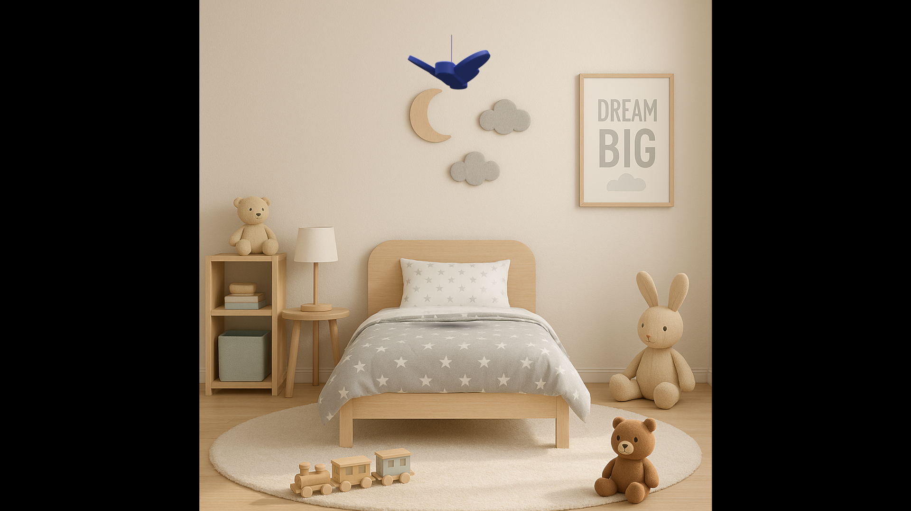

# slimme lichtprojector
de slimme lichtprojector die kinderen ondersteunt bij het krijgen van een goede nachtrust.

🛠️ Built by Felix Vanhoutte & Jendrik Bottelberghe   
🔥 Supervised by prof. dr. Bas Baccarne& Yannick Christiaens. 
🌱 Grown at Ghent University 🏛️ Industrial Design Engineering ([project overview](https://github.com/basbaccarne/human-centered-design))       

11/12/2025 van de laatste update*   

## Samenvatting
Max 200 woorden. Beschrijf je project in het kort, waarbij je deze vragen zeker beantwoordt:

- Wat is het probleem?
- Hoe heb je dit onderzocht?
- Wat is jouw oplossing?
- Hoe lost jouw oplossing het probleem op?

## Introductie
De slimme lichtprojector biedt hulp aan kinderen met slaapproblematiek. Het probleem dat ouders midden in de nacht wakker gemaakt worden door hun kinderen dient opgelost te worden met behulp van ons project. De slimme lichtprojector merkt op dat het kind ontwaakt en schiet meteen in actie. De projector schijnt rustgevende, ritmische beelden of strobes en maakt witte ruis om het kind rustiger te maken. De instellingen van de projector kunnen door de ouders ingesteld worden met behulp van een app. Zo kan het product op elk kind afgesteld worden. Het is de bedoeling dat de projector zo gemakkelijk mogelijk te installeren is, zonder veel kabels te moeten verbinden of gaten te moeten boren in het plafond. 
Maak gebruik van bronverwijzingen ([zie APA stijl](https://www.scribbr.nl/category/apa-stijl/)). Zoals bijvoorbeeld (Thomas & Ritter, 2022) [^1] .

## Inhoudstafel

1. [Methodologie](./docs/methodologie.md)
2. [Discovery](./docs/discovery.md)
3. [Defintion](./docs/definition.md)
4. [Design Requirements](./docs/design_requirements.md)
5. [Bill of materials](./docs/bom.md)

## Kritische reflectie
Max. 500 woorden

## Noot inzake het gebruik van AI
Licht toe op welke manier je AI gebruikte in dit project.

## Bijlagen
### Discovery
* Literatuuronderzoek (N=)
  * [Protocol]()
  * [Rapport]()
* Interviews (N=6)
  * [Protocol]()
  * [Rapport]()
    
### Definition
* User testing wave 1 (N=8)
  * [Protocol](url)
  * [Rapport](url)
* User testing wave 2 (N=8)
  * [Protocol](url)
  * [Rapport](url)

## Licentie
> :warning: voeg jullie namen toe in de documenten hieronder en delete dan dit lijntje   

This repository contains both software and design materials created as part of an industrial design energineering project at Ghent University.

- **Software and code:** [MIT License](./LICENSE-MIT)  
- **Design, documentation, CAD, and media:** [CC BY 4.0 License](./LICENSE)
  
You are free to reuse and build upon this work, both commercially and non-commercially, as long as proper attribution is given to the original authors.

## Bronnen
 [^1]: Thomas, T., & Ritter, A. (2022). Wandering & sundowning in dementia. _Practical Neurology, 21_(3), 36–44.
