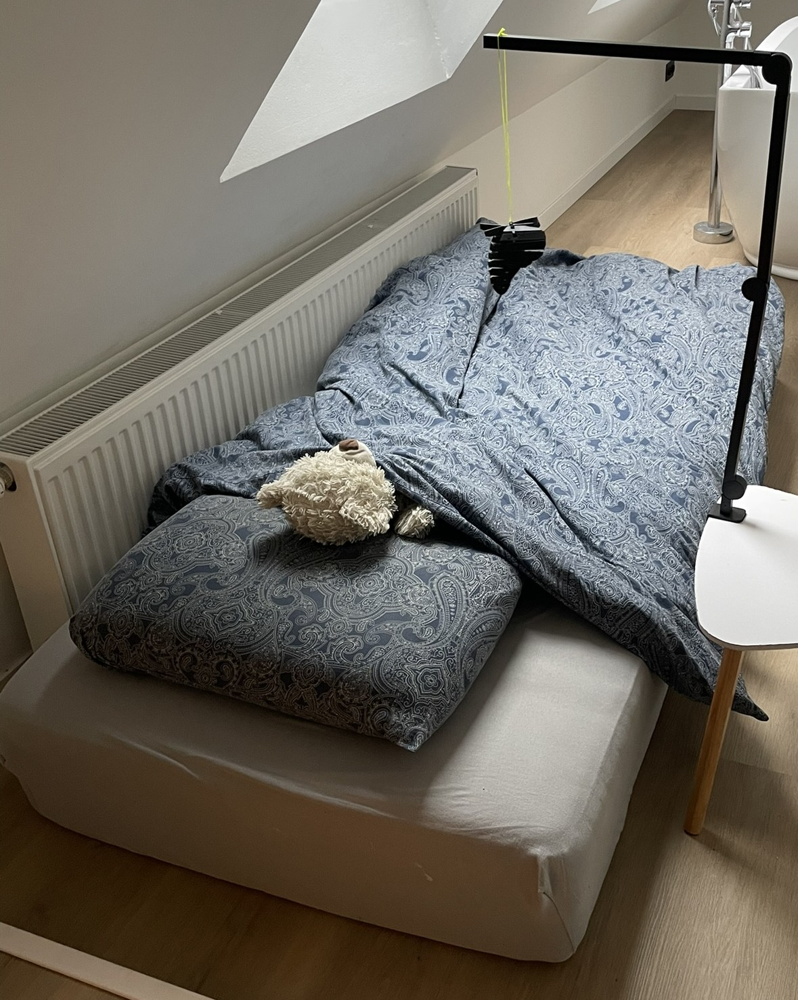
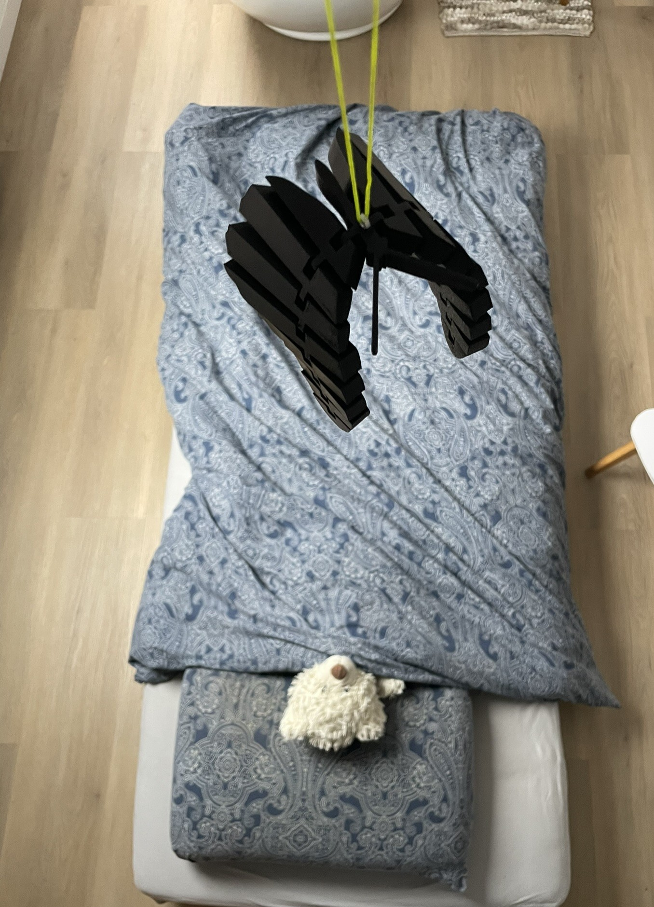
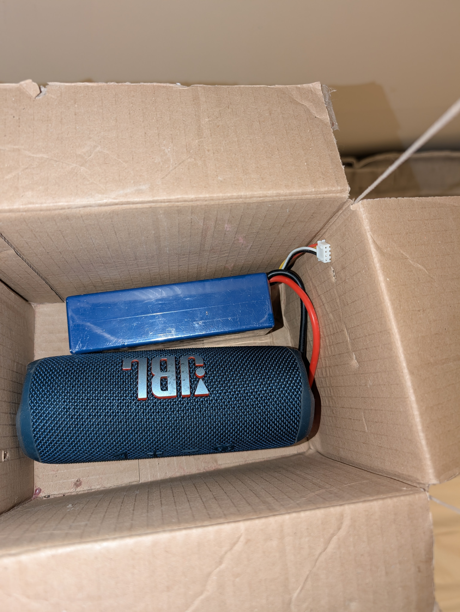
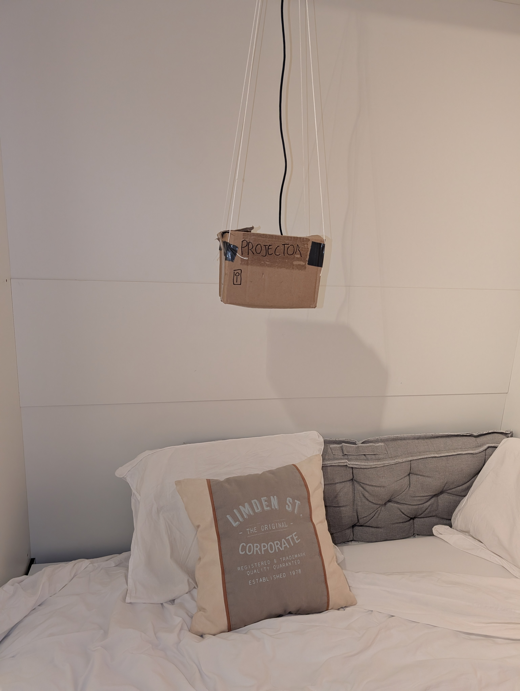

## Definition

### Doestellingen

In deze fase van het ontwerp was het noodzakelijk om grote, belangrijke keuzes te maken om dan later met een goede basis verder te kunnen werken. Het product moet makkelijk op te zetten zijn en moet ook effectief rust bieden aan kinderen. De voornaamste onderzoeksvragen waren hierbij: "Hoe zal het product opgezet worden, zodat het functioneel is en niet in de weg hangt?" en "Hoe interpreteren en gebruiken ouders de spreekfunctie en welke energievoorziening heeft hun het meeste vertrouwen."
Om op de eerste onderzoeksvraag te antwoorden werd een prototype in een eerste gebruikerstest volgens het "Think aloud program" getest. Met een ander prototype werd de tweede onderzoeksvraag getest volgens "Questions Ask Protocol".
De testen werden uitgevoer door ouders, aangezien zij het meest in contact zullen komen met het ontwerp.

### Materiaal & methoden

Beide onderzoeken werden apart uitgevoerd.
Het eerste onderzoek maakte gebruik van een bureaulamp-armatuur, verbonden aan een 3D-geprinte vlinder dat de projector voorstelt. Deze werden verbonden met een touwtje. Ook was er een figma template, gegenereerd door Ai, die zich voordeed als de software van de lichtprojector.[figma](https://www.figma.com/make/z6YTW5lYvv8C9mwTjm8RgK/Bluetooth-Projector-Control-Interface?t=xq9Ykq11bSMpZqXp-1).
De eerste test volgde dit [protocol](../reports%20and%20protocols/Bottelberghe_Jendrik_onderzoeksprotocol%20ophangsysteem.pdf). Hier was de bedoeling dat de gebruiker enkele testjes volgde met het ontwerp en luidop vertelde wat ze aan het doen waren. Zo kon onderzocht worden als het ontwerp intuïtief genoeg was, en wat de gebruiker denkt van het design.

De resultaten van het eerste ontwerp maakten duidelijk dat er aanpassingen nodig waren. De feedback van de figma template was verrassend goed, hier werden ook geen verdere aanpassingen aan gedaan. Bij de tweede iteratie werd het ophangsysteem vereenvoudigd. De projector werd opgehangen boven het bed. Dit gebeurde met touwtjes die de projector vanaf het plafond naar beneden liet hangen.

De gebruikers hadden meteen door hoe ze dit konden bevestigen. Het enige nadeel bij dit systeem was dat voor een hi-fi prototype er aanpassingen zullen moeten gebeuren aan het plafond (gaten boren / vijzen). Wanneer dit aan de gebruikers werd voorgelegd was dit een minder groot probleem dan gedacht. Aangezien deze manier een pak veiliger was dan dat in wave 1, was dit een goede verbetering.  

Het tweede onderzoek maakte gebruik van een low-fidelity fysiek prototype dat de projector voorstelde, met een ingebouwde speaker om de spreekfunctie te simuleren. Het prototype werd boven het kinderbed opgehangen om de gebruikscontext zo realistisch mogelijk te maken. Daarnaast werd een Figma-template, ontwikkeld om de bijhorende app na te bootsen waarmee ouders een boodschap konden inspreken en activeren.
De test werd uitgevoerd als een taak-gebaseerde gebruikstest met QAP volgens dit [protocol](../reports%20and%20protocols/Onderzoeksprotocol%20spreekfunctie,%20energievoorziening%20(QAP).pdf). Deelnemers gebruikten het systeem in verschillende scenario’s en verwoordden luidop wat ze deden en verwachtten. Zo werd onderzocht of de spreekfunctie intuïtief werd begrepen en hoeveel mentale belasting het gebruik van de app vroeg, gekoppeld aan de design requirements rond eenvoud, controle en lage cognitieve last.
 werkte het prototype op een oplaadbare batterij.

in een tweede iteratie werd hetzelfde prototype getest met een vaste elektriciteitskabel.

### Resultaten

Uit de gebruikservaring van de twee waves werd duidelijk dat het ophangsysteem in de tweede wave een upgrade was van de eerste versie. Dit was echter vooral omdat dit ontwerp veel veiliger was, en niet per se makkelijker op te zetten.
"Da geeft niet dat dat daar hangt te bengelen."
Ook kon het ontwerp niet in de weg staan. Er bleek echter wel noodzaak om de ophanging makkelijker te maken en eventueel zonder boren. Hoewel dit niet opwoog tegen veiigheid, waren er wel opmerkingen dat hier nog over nagedacht mocht worden. De UI van de software was goed. Alleen was er een idee van een gebruiker om een instelbare tijd toe te voegen.
"Da's wel gemakkelijk, die app."

Uit de tweede test volgde:
De resultaten tonen aan dat de spreekfunctie snel en intuïtief werd begrepen: gebruikers herkenden meteen dat de ouderstem bedoeld was om het kind gerust te stellen bij nachtelijk ontwaken. Tegelijk gaf het QAP aan dat ouders twijfelden over het juiste moment en de frequentie van gebruik, wat wijst op een sterke behoefte aan controle en voorspelbaarheid. Wat betreft de energievoorziening bleek betrouwbaarheid belangrijker dan esthetiek. De batterijoplossing riep onzekerheid op over een mogelijk lege batterij tijdens de nacht en werd daardoor als risicovol ervaren. De vaste elektriciteitskabel gaf gebruikers meer rust en vertrouwen, ondanks het minder verzorgd uitzicht. Deze inzichten bevestigen dat het systeem altijd beschikbaar moet zijn zonder extra handelingen van de ouder, en dat ontwerpkeuzes in een nachtelijke context vooral moeten inzetten op zekerheid en mentale rust.

### Conclusies & implicaties

1. Keuze voor het vereenvoudigde ophangsysteem boven het bed:
Op basis van de gebruikerstesten werd beslist om het ophangsysteem uit wave 1 te verlaten en te kiezen voor het vereenvoudigde systeem waarbij de projector boven het kinderbed hangt, bevestigd aan het plafond met touwtjes.
Deze keuze werd niet gemaakt omdat het systeem per se makkelijker op te zetten was, maar omdat het als aanzienlijk veiliger werd ervaren en minder in de weg hing.
Hoewel gebruikers aangaven dat boren in het plafond niet ideaal is, woog dit nadeel niet op tegen de verhoogde veiligheid en stabiliteit.
Wel werd beslist dat in verdere iteraties gezocht moet worden naar een oplossing die even veilig is, maar minder invasief (bijvoorbeeld zonder boren).

2. Implementatie van de spreekfunctie met ouderstem:
De spreekfunctie werd behouden als kernfunctionaliteit van het product.
Uit de QAP-test bleek dat ouders deze functie onmiddellijk correct interpreteerden als een manier om hun kind te geruststellen bij nachtelijk ontwaken.
Daarmee werd bevestigd dat het concept begrijpelijk en emotioneel relevant is, zonder extra uitleg nodig te hebben.
Wel werd beslist dat het systeem duidelijke feedback moet geven over wanneer en hoe vaak de spreekfunctie actief is, om twijfel en mentale belasting te verminderen.

3. Keuze voor vaste elektriciteitskabel in plaats van batterij:
Op basis van de tweede gebruikerstest werd beslist om de oplaadbare batterij niet te gebruiken als primaire energievoorziening.
Gebruikers ervaarden onzekerheid over een lege batterij tijdens de nacht als een groot risico.
De vaste elektriciteitskabel werd verkozen omdat die meer betrouwbaarheid, rust en vertrouwen bood, ondanks het minder esthetische uitzicht.
Deze beslissing vertrekt expliciet vanuit de nachtelijke gebruikscontext, waarin zekerheid belangrijker is dan visuele afwerking.

4. Ontwerpprincipe: altijd beschikbaar, zonder extra handelingen
Overkoepelend werd beslist dat het systeem zo ontworpen moet worden dat het altijd operationeel is, zonder dat ouders vooraf iets moeten opladen, activeren of controleren.
Dit vertaalt zich in:

-een vaste stroomvoorziening

-automatische werking

-minimale instellingen

-duidelijke voorspelbaarheid van functies (zoals de spreekfunctie en timing)

Dit principe stuurt verdere ontwerpkeuzes aan, zowel hardwarematig als softwarematig.